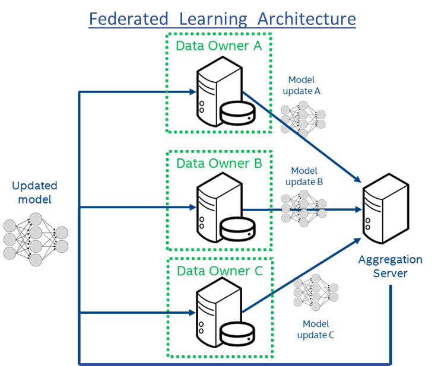

# Diagnosing Acute Inflammations of Bladder

## Abstract
This machine learning system can diagnose 2 acute inflammations of bladder. The medical dataset contains features and diagnoses of 2 diseases of the urinary system: Inflammation of urinary bladder and nephritis of renal pelvis origin. This medical dataset truly needs privacy! Because we cannot divulge the sexually-transmitted diseases of patients. So, what we learned about PySyft and OpenMined is applied in this project. Federated learning will protect the privacy of datasets in each hospital and at the same time, a more robust machine learning model will benefit all hospitals. Why? Because the machine learning model generated in this project is 100% accurate; whereas human doctors can commit mistakes when diagnosing these 2 diseases.

## DATASET

Acute Inflammations Data Set  
https://archive.ics.uci.edu/ml/datasets/Acute+Inflammations

 

## Software Requirements

Please make sure that the following software is installed before running this machine learning system:
- Python 3.7.3 (imports: urllib.request, numpy, torch, torch.autograd, torch.nn, torch.nn.functional, torch.optim, matplotlib.pyplot, syft)
- PyTorch 1.1.0
- PySyft 

## Instructions

Download and run the Jupyter notebook **Bladder Dataset.ipynb**, which contains both explanations and source code.

## Relevance & Potential 

Machine learning projects are great to improve our world, to solve problems, and to take informed decisions. This project could help doctors to diagnose diseases of the urinary tract correctly. And then doctors could take the appropriate actions to cure such diseases. In fact, this machine learning system is 100% accurate; whereas human doctors could commit mistakes while diagnosing these 2 diseases. However, forgotten aspects of machine learning are security and privacy. This machine learning is not only very useful and accurate; but it also protects the privacy of datasets in each hospital by using federated learning.

This machine learning system also has a lot of potential for the future. The code of this ML system is pattern that can be copied and extrapolated to more complex kinds of diagnoses. For example, we can change the logistic regression algorithm for a convolutional neural network capable of dealing with datasets of medical images. And the logic to protect the privacy of datasets in each hospital will be the same.

## Federate Learning with a Trusted Aggregator

In this demo, there are 4 hospitals. (The datasets will be split in 4, randomly.) And the 4 hospitals cannot share their cases because they are competitors. Hence, the ML model will be learned in a federated way by sending the model updates to a trusted aggregator that will average the model updates. The updated model will be sent back to each hospital in order to train the ML model in an iterative way. Only the ML model will be shared. Whereas the cases of each hospital will be kept private and will train model updates in a local way. 
 

 
 Federated Learning - Image taken from <a href="https://www.intel.ai/federated-learning-for-medical-imaging/">https://www.intel.ai/federated-learning-for-medical-imaging/</a>

## Author
Juan Carlos Kuri Pinto 
**Slack:** @Juan Carlos Kuri Pinto 
**LinkedIn:** https://www.linkedin.com/in/jckuri/ 
**GitHub:** https://github.com/jckuri 
**E-mail:** jckuri@gmail.com 
